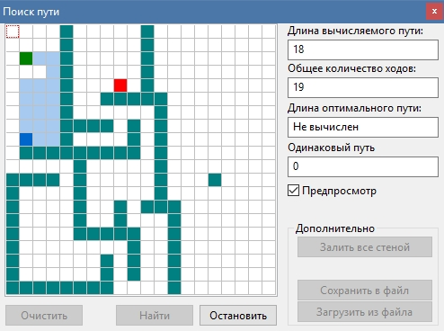

# PathFinder
Алгоритм поиска оптимального пути, самый простой, который я смог придумать во время учебы в техникуме.  
Проект написан в среде Lazarus IDE в 2015 году для какой-то олимпиады. 

## Особенности
- Возможно создавать свою карту (поле для поиска)  
- Сохранение/загрузка карт для демонстрации решений поиска  
- Просмотр процесса поиска, или ускоренное вычисление без отрисовки  

  

## Метод поиска
Вычисляет позицию цели, затем пытается дойти по прямому пути, если не выходит, то меняет направление на 90 градусов и повторяет действия.  
После находения пути - подсвечивает путь и пытается найти более короткий. 